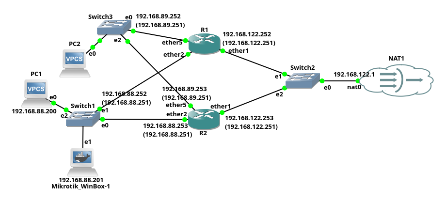

# Настройка VRRP на Mikrotik
- Роутеры `Mikrotik RB450G`.
- RouterOS 7.8
- Эмулятор сети `GNS3`  

  

1. [Настройка на R1](VRRP-R1.rsc)
2. [Настройка на R2](VRRP-R2.rsc)  

PC1:
```shell
ip 192.168.88.200/24 192.168.88.1
ip dns 77.88.8.8
ping -t google.com
```